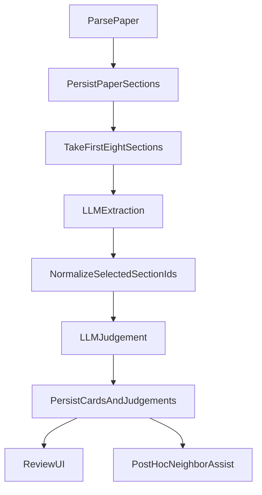
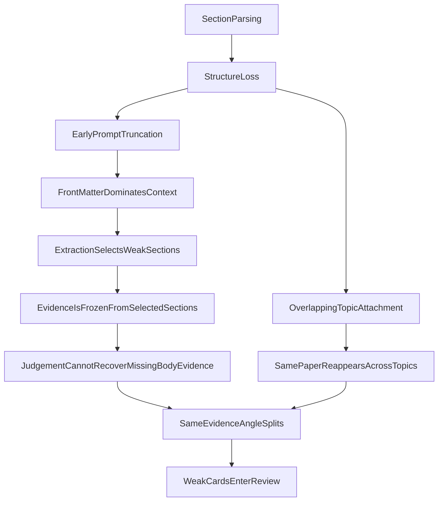
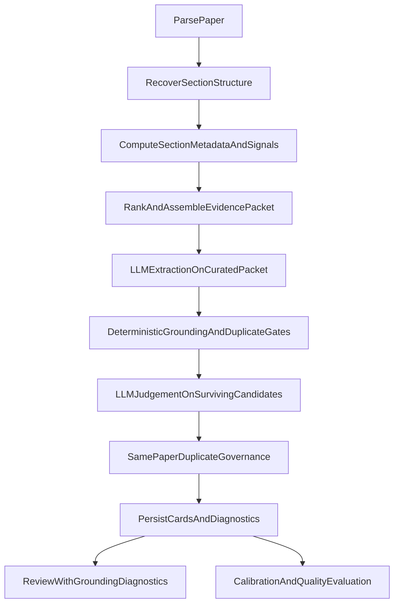

# Card Content Remediation

## Purpose

This document is the execution blueprint for fixing card content quality in `paper2bullet`.

It is written so that a future AI agent can start implementation directly without reconstructing the problem from chat history.

The remediation target is not “slightly better prompt wording.” The target is a system that satisfies the ideal state described in `CONCEPT.md`: extract high-value, atomic, learner-facing `aha` cards from the real evidentiary core of papers, not from paper framing, abstract summaries, or duplicated angle variants.

## Source Of Truth

This remediation must follow the product intent in:

- `CONCEPT.md`
- `PRD.md`
- `PROBLEMS.md`

When these sources disagree:

1. `CONCEPT.md` defines the ideal content-quality target.
2. `PRD.md` defines implementation tracks and operational constraints.
3. `PROBLEMS.md` records currently observed failures.

## Non-Negotiable Product Requirements

Derived from `CONCEPT.md`, the remediation must preserve these invariants:

- A card is an `aha moment`, not a paper summary.
- A card must be grounded in the paper's real evidentiary object:
  - mechanism
  - model
  - method
  - result
  - failure mode
  - framework
  - concrete data finding
- A card must stay atomic.
- Atomicity does not justify letting the same core evidence spawn multiple framing variants.
- Atomicity also does not justify letting the same paper resurface across multiple overlapping topics as if those were separate discoveries.
- `它在课程里变成什么` remains a hard gate.
- Review should focus on real boundary cases, not on repeatedly cleaning up systematic upstream defects.
- Dedupe, saturation, calibration, and evidence quality must be connected into one governance surface.

## Current Failure Surface

The quality failures currently cluster into three linked problem families:

1. `Same-evidence near-duplicate cards`
2. `Same-paper cross-topic resurfacing`
3. `Abstract/front-matter evidence bias`
4. `Paper-specific value and mechanism loss`

These are recorded in `PROBLEMS.md`.

They are not independent bugs. They come from one broken upstream chain.

## Current Card Production Chain

Today the pipeline is effectively:

The important implementation points are:

- `app/services.py`
  - `PaperPipeline.build_cards()`
  - `PaperPipeline._build_cards_with_llm()`
  - `PdfParser`
  - `split_paragraphs()`
- `app/llm.py`
  - `extract_candidates()`
  - `judge_candidates()`
  - `_build_prompt_sections()`
  - `_build_extraction_prompt_payload()`
  - `_build_judgement_prompt_payload()`
  - `_normalize_extraction_output()`
  - `_normalize_judged_cards()`
- `app/db.py`
  - `paper_sections`
  - `candidate_cards`
  - `judgements`
- `app/main.py`
  - review detail endpoints
  - debug endpoints
- `app/static/index.html`
  - current review detail rendering
- `tests/test_app.py`
  - current regression envelope

## Root-Cause Chain

The system is currently failing upstream, before judgement.

### Root Cause 1: Section Structure Loss

The parser often stores sections with generic titles like `Markdown Extraction`, which erases the distinction between:

- abstract
- front matter
- introduction
- methods
- results
- discussion
- appendix

Without this structure, later stages cannot reliably prefer body evidence over framing evidence.

### Root Cause 2: Prompt Input Is Order-Biased

`app/llm.py` currently truncates to the first `MAX_PROMPT_SECTIONS`.

That means the LLM often sees:

- title
- author block
- affiliations
- arXiv metadata
- abstract
- keywords
- citation block

before it sees the actual mechanism/result sections of the paper.

For many papers, the true content begins after the current prompt window.

### Root Cause 3: No Evidence Selection Layer

The system has parsing and section storage, but no proper evidence-selection stage between parsing and prompting.

There is no ranking by:

- topic relevance
- section type
- evidence density
- figure linkage
- novelty
- paper-specific contribution density

As a result, truncation happens before selection.

### Root Cause 4: Extraction Rules Are Intentional But Not Enforced

The extraction prompt says:

- do not output generic summaries
- use evidence
- prefer teachable candidates

But there is no hard rule that says:

- if body evidence exists, abstract cannot be the primary evidence
- a card must identify the paper's specific contribution object
- a framing-only card must be excluded

### Root Cause 5: Judgement Is Downstream-Only

Judgement only sees extracted candidates and their already-selected evidence.

It cannot:

- inspect the full paper
- retrieve stronger body sections
- re-rank evidence
- replace abstract evidence with body evidence

So judgement can only accept, downgrade, or reject a bad candidate. It cannot recover a missing one.

### Root Cause 6: Duplicate Governance Is Too Late

Current duplicate assistance is mostly post-persistence:

- neighbor lookup
- similarity labels
- review-time hints
- saturation metrics

This is useful for review, but too late to stop the system from generating and storing multiple cards from the same core evidence.

### Root Cause 7: Paper-Level Dedupe Is Weaker Than Topic Fan-Out

The pipeline can attach one paper to many overlapping topics before it has committed to the paper's strongest reportable aha.

That creates a bad multiplication effect:

- one paper enters multiple topic lanes
- each lane can independently generate cards
- the same core paper object gets reframed several times

This is not true discovery diversity. It is resurfacing caused by topic overlap.

## Target Architecture

The target pipeline must be:

This architecture introduces three missing first-class concepts:

1. `section structure recovery`
2. `evidence packet assembly before prompting`
3. `pre-persist grounding and duplicate gates`
4. `paper-level strongest-aha selection before topic-level resurfacing`

## Remediation Tracks

## Track 0: Paper-Level Dedupe Before Topic Multiplication

### Goal

Prevent one paper from gaining false importance simply because it matched multiple overlapping topics.

### Required changes

- add a paper-level strongest-aha decision before allowing repeated topic-specific card generation
- treat topic as a routing lens, not as an independent reason to keep another card
- suppress same-paper resurfacing unless the second candidate is clearly independent in object, learner shift, and course use

### Acceptance criteria

- same paper appearing in many topic buckets no longer increases its card count by default
- the default behavior becomes `one strongest aha per paper`
- additional cards require explicit evidence of independence, not merely different framing

## Track 1: Section Structure Recovery

### Goal

Recover meaningful paper structure so the system can distinguish front matter from real body evidence.

### Required changes

Extend the `paper_sections` contract in `app/db.py` and repository hydration in `app/services.py` to include fields such as:

- `section_kind`
- `section_label`
- `is_front_matter`
- `is_abstract`
- `is_body`
- `body_role`
- `has_figure_reference`
- `source_format`

### Parsing requirements

Unify structure inference across:

- MarkItDown-based PDF extraction
- PDF text-page fallback
- HTML ingestion

The parser must explicitly classify:

- title block
- author/affiliation block
- abstract
- keywords / CCS / citation metadata
- introduction
- methods
- results
- discussion
- conclusion
- references
- appendix / other

### Implementation strategy

- Add new columns in `app/db.py`
- Update parser output objects in `app/services.py`
- Add a reusable section classification helper in `app/services.py`
- Preserve backward compatibility by defaulting missing old rows to neutral values

### Acceptance criteria

- New runs persist section structure metadata
- At least `Abstract` vs `Body` is explicitly available to downstream logic
- Old runs remain readable without migration failure

## Track 2: Evidence Selection Before Prompting

### Goal

Replace `first-N sections` prompting with ranked and coverage-aware evidence packets.

### Required changes

Add a new evidence-selection layer in `app/services.py`, logically between:

- `Repository.get_sections()`
- `LLMCardEngine.extract_candidates()`

This layer should produce a `structured evidence packet` containing:

- `context_sections`
- `primary_candidate_sections`
- `supporting_sections`
- `figure_candidates`
- `selection_diagnostics`

### Ranking signals

Rank sections using a weighted combination of:

- topic relevance
- body-vs-front-matter weighting
- section role weighting
- evidence density
- novelty within paper
- figure linkage
- model/mechanism/result likelihood

### Hard selection rules

- Abstract may appear in context, but should not dominate the primary evidence packet when body sections exist.
- Front matter must not consume meaningful prompt budget.
- If the first usable body evidence appears after the current `MAX_PROMPT_SECTIONS` cutoff, it must still be selectable.
- The selector must maximize content diversity inside one paper to reduce same-evidence multi-card splitting.

### Acceptance criteria

- Prompt assembly no longer depends on source order alone
- Body sections are routinely available in extraction input
- Debug output can explain why each section was selected

## Track 3: Extraction Prompt Redesign

### Goal

Force extraction to identify the paper's specific contribution before it is allowed to write a card.

### Required changes

Rewrite `_build_extraction_prompt_payload()` in `app/llm.py`.

The new prompt must distinguish:

- allowed primary evidence
- allowed supporting evidence
- disallowed primary evidence

### New prompt rules

The extraction prompt must explicitly state:

- the primary evidence of a card should come from mechanism/model/method/result/failure sections
- abstract or problem framing may only play supporting context roles
- if the paper-specific object cannot be named, emit no card
- if the candidate is only about what the paper is generally about, emit excluded content

### New extraction output contract

Require extraction to output richer fields, for example:

- `primary_section_ids`
- `supporting_section_ids`
- `claim_type`
- `paper_specific_object`
- `body_grounding_reason`
- `evidence_level`
- `possible_duplicate_signature`

These fields are not UI-only. They are needed for later gates.

### Acceptance criteria

- Extraction candidates always identify the concrete object being taught
- Framing-only cards can be programmatically detected
- Section role is visible in the extracted candidate payload

## Track 4: Judgement Hard Gates

### Goal

Make judgement a real content-validity guard, not just a language formatter and color labeler.

### Deterministic gates before or during judgement

Implement gates in `app/services.py` or `app/llm.py` before persistence:

- `abstract_dominant_evidence_gate`
- `front_matter_primary_evidence_gate`
- `paper_specific_object_missing_gate`
- `same_evidence_cluster_gate`
- `weak_body_grounding_gate`

### Gate behavior

When a candidate fails a hard gate:

- do not persist it as a card
- convert it into excluded content when possible
- tag the exclusion with a structured reason

### Judgement prompt changes

Rewrite `_build_judgement_prompt_payload()` so that judgement must explicitly answer:

- what is the paper's unique object here
- is this claim grounded in body evidence or only in paper framing
- does this card remain distinct from sibling candidates in the same paper/topic
- is the evidence strength proportional to the claim

### Acceptance criteria

- Judgement can reject framing-only cards even if they are teachable-sounding
- Yellow cards become true boundary cases, not generic weak cards
- The system can explain why a card was rejected for weak grounding

## Track 5: Same-Paper Duplicate Governance

### Goal

Suppress same-evidence framing variants before they enter the card pool.

### Required changes

Add generation-time clustering in `app/services.py` on the scope:

- `run + paper + topic`

### Duplicate features

Build duplicate decisions from:

- overlap of `primary_section_ids`
- overlap of all evidence section ids
- semantic similarity of candidate claims
- similarity of course transformations
- similarity of teachable one-liners
- claim type overlap
- paper-specific object overlap

### Constraint from `CONCEPT.md`

Do not auto-merge cards.

Instead:

- detect clusters
- rank the strongest representative
- suppress obvious framing variants
- reclassify weaker variants to excluded content using `replaced_by_stronger_card`

### Acceptance criteria

- same-evidence multi-card clusters are strongly reduced
- atomic cards remain possible when they truly represent different contribution objects
- duplicate cluster diagnostics are stored for review

## Track 6: Review, Evaluation, And Governance Closure

### Goal

Turn content quality into a governed system surface.

### Review UI and API

Extend `app/main.py` and `app/static/index.html` so review detail displays:

- section type mix of the card's evidence
- whether primary evidence is abstract/front matter/body
- duplicate cluster membership
- same-paper sibling candidates
- paper-specific object
- grounding reason

### Calibration additions

Extend calibration examples and workflow to include explicit failure buckets:

- abstract-only evidence
- framing-only card
- same-evidence duplicate split
- paper-specific object missing
- body evidence ignored despite availability

### Evaluation metrics

Add formal metrics, not just manual spot-check:

- `abstract_backed_card_rate`
- `front_matter_primary_rate`
- `body_grounded_card_rate`
- `same_evidence_duplicate_escape_rate`
- `paper_specific_object_presence_rate`
- `accepted_card_body_grounding_rate`
- `accepted_card_duplicate_conflict_rate`

### Acceptance criteria

- reviewers can see why a card is weak
- evaluation runs can measure these failures directly
- calibration becomes failure-specific rather than generic

## Data Model Plan

The following persistence changes are expected.

### `paper_sections`

Add structure metadata fields:

- `section_kind`
- `section_label`
- `is_front_matter`
- `is_abstract`
- `is_body`
- `body_role`
- `selection_score`
- `selection_reason_json`

### `candidate_cards`

Add grounding and duplicate-governance fields:

- `primary_section_ids_json`
- `supporting_section_ids_json`
- `paper_specific_object`
- `claim_type`
- `evidence_level`
- `body_grounding_reason`
- `grounding_quality`
- `duplicate_cluster_id`
- `duplicate_rank`
- `duplicate_disposition`

### New optional tables

If the inline-card fields become too dense, introduce dedicated tables:

- `card_grounding_diagnostics`
- `card_duplicate_clusters`
- `card_duplicate_memberships`

The design should stay consistent with current repository patterns in `app/services.py`.

## API And UI Plan

### API

Extend payloads in `app/main.py` to expose:

- section diagnostics
- duplicate diagnostics
- grounding diagnostics
- quality metric summaries

### UI

Extend review and run detail displays in `app/static/index.html`:

- show whether evidence is abstract/front/body
- show duplicate cluster info
- show same-paper sibling candidates
- show primary and supporting evidence separation
- show paper-specific object

The UI goal is not polish first. The goal is to make bad grounding visible and auditable.

## Migration And Rollout

Rollout must be staged and measurable.

### Phase 1: Schema And Diagnostics Foundation

- extend schema
- preserve old rows
- add structure metadata
- add grounding/duplicate fields

### Phase 2: Evidence Selection Layer

- implement section classification
- implement section ranking
- build structured evidence packets
- expose debug diagnostics

### Phase 3: Extraction And Judgement Contract Upgrade

- rewrite extraction payload
- upgrade output schema
- add deterministic gates
- upgrade judgement payload

### Phase 4: Duplicate Governance

- cluster same-paper candidates
- suppress weak framing variants
- expose duplicate diagnostics

### Phase 5: Review And Evaluation Closure

- add review diagnostics
- add quality metrics
- add calibration failure buckets
- update regression and evaluation suites

### Phase 6: Historical Comparison And Rerun Policy

- compare pre-fix and post-fix runs using the new metrics
- decide which historical runs need rerun
- do not mix legacy quality numbers with post-fix quality numbers without labeling

## Verification Strategy

Verification is mandatory, not optional.

### Unit tests

Add tests for:

- section structure classification
- evidence ranking and packet assembly
- abstract/body gating
- paper-specific object validation
- same-paper duplicate suppression

### Integration tests

Add end-to-end tests for:

- paper parse to card generation using body-priority evidence
- abstract available but body preferred
- same paper producing one representative card instead of several framing variants
- excluded content receiving structured reasons

### Regression tests

Protect existing flows:

- review
- export
- access queue
- observability
- calibration workflow

### Data validation

For new runs, compare:

- abstract-backed card rate
- body-grounded card rate
- duplicate escape rate
- accepted-card quality metrics

### Human spot-check

For each new iteration:

1. sample accepted cards from latest runs
2. verify they expose the paper's real model/mechanism/result
3. verify they are not just abstract-level reframings
4. verify sibling cards are meaningfully distinct

## Acceptance Criteria

The remediation is not complete until all of the following are true:

- Abstract-backed cards materially decrease in new runs.
- Same-evidence duplicate clusters materially decrease in new runs.
- Accepted cards more reliably surface the paper's specific model, mechanism, framework, or result.
- Reviewers can immediately see grounding diagnostics and duplicate diagnostics.
- Evaluation runs report content-quality metrics formally.
- The system prefers `0 cards` over weakly grounded framing cards.

## Anti-Patterns To Avoid

The implementation must explicitly avoid these shortcuts:

- Do not only tweak wording in the judgement prompt.
- Do not keep `sections[:MAX_PROMPT_SECTIONS]` and call it “good enough.”
- Do not rely on review UI to clean up systematic extraction failures.
- Do not auto-merge cards in a way that violates atomicity.
- Do not evaluate success by fluency alone.
- Do not compare legacy and post-fix card quality without segmentation.

## Execution Checklist

Use this as the direct implementation order:

1. Extend section metadata schema and parser outputs.
2. Implement section classification helpers.
3. Build evidence packet selection and diagnostics.
4. Rewrite extraction prompt payload and output schema.
5. Add grounding gates and paper-specific object validation.
6. Upgrade judgement payload and rejection logic.
7. Add same-paper duplicate clustering and suppression.
8. Extend persistence for diagnostics.
9. Extend review/debug API and UI.
10. Add evaluation metrics and calibration buckets.
11. Add unit, integration, regression, and data-quality tests.
12. Compare pre-fix and post-fix runs before wider rollout.

## Deliverables

A complete implementation of this remediation should produce:

- updated `PROBLEMS.md`
- schema and repository changes in `app/db.py` and `app/services.py`
- section-selection and grounding logic in `app/services.py`
- prompt and normalization contract upgrades in `app/llm.py`
- API and UI diagnostics in `app/main.py` and `app/static/index.html`
- new regression and evaluation coverage in `tests/test_app.py`
- measurable quality improvements on fresh runs
