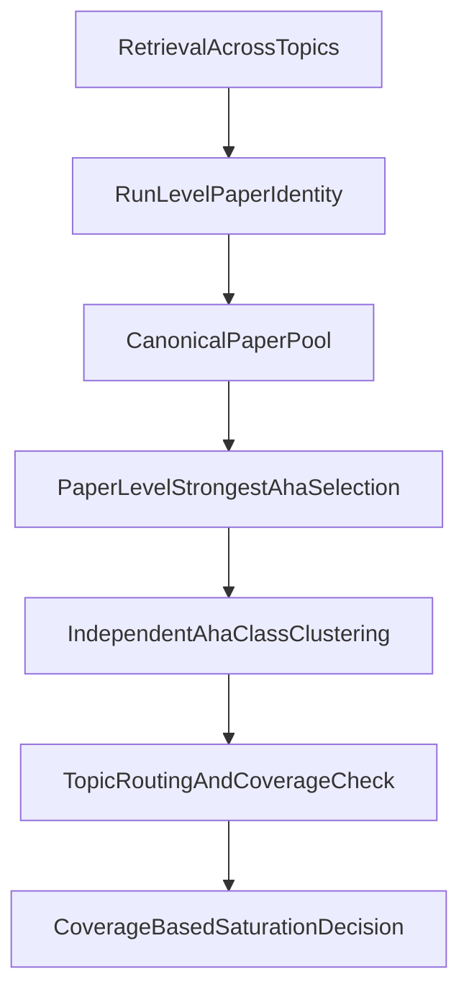

# Dedupe And Saturation Remediation

## Purpose

This document is the implementation-ready remediation plan for two linked structural failures in `paper2bullet`:

- dedupe does not yet prevent the same paper from resurfacing across multiple overlapping topics and generating repeated cards
- saturation does not yet measure whether the system has exhausted new independent `aha` space; it mainly measures card overlap and card-count flattening

This document does not propose prompt polish. It proposes a change in governance unit, decision order, and evaluation logic.

## Source Of Truth

This remediation follows:

- `CONCEPT.md`
- `PRD.md`
- `app/services.py`

When they disagree:

1. `CONCEPT.md` defines the content-quality target.
2. `PRD.md` defines product and workflow constraints.
3. `app/services.py` defines the current implementation boundary that this plan must replace or extend.

## Executive Summary

The current pipeline still reasons in the wrong unit at two critical steps.

### Dedupe problem

The system can dedupe:

- the same discovery result inside one topic search
- obvious same-paper card variants inside one local card batch

But it does not yet govern the unit that actually matters for this product:

- one canonical paper across the whole run
- one strongest `aha` per paper by default
- one independent `aha class` across topics

As a result, the same paper can gain false importance simply by matching multiple adjacent topics.

### Saturation problem

The system currently treats these as major signals:

- `semantic_duplication_ratio`
- `incremental_new_cards`
- `tail_incremental_new_cards == 0`

These are useful diagnostics, but they are not the primary object we actually care about.

The real question is not:

- "Are we still generating cards?"

The real question is:

- "Are we still discovering new independent, reportable `aha` classes that are worth leadership attention and course use?"

Until saturation is tied to `independent aha classes`, the system will continue to confuse:

- search strategy overlap
- low-value technical card proliferation
- same-paper cross-topic resurfacing

with genuine remaining discovery space.

## Problem Statement

Four different issues are currently mixed together and need to be separated.

### 1. Provider / strategy-level discovery dedupe

This asks:

- did multiple providers or search strategies return the same paper inside one topic search?

This is necessary, but it is only the shallowest form of dedupe.

### 2. Same-paper cross-topic resurfacing

This asks:

- did one canonical paper attach to multiple overlapping topics inside the same run?
- did those topic attachments multiply downstream card generation?

This is the main failure behind the recent run-level duplication problem.

### 3. Same-paper multi-card duplication

This asks:

- did one paper produce multiple cards that are really just the same core insight with different framing, sections, or teaching angle?

This is where current same-paper duplicate suppression helps somewhat, but not enough.

### 4. False saturation from card-count flattening

This asks:

- are we stopping because there are no new cards, or because there are no new independent `aha` classes?

These are not the same thing.

## Current Root Cause Analysis

## Root Cause 1: Discovery dedupe is scoped to one topic search, not to the whole run

Current discovery identity logic in `app/services.py` correctly normalizes one paper identity from DOI, arXiv ID, OpenAlex ID, Semantic Scholar ID, or fallback title-year-author key.

That helps collapse repeated provider hits for one topic query.

But the current dedupe is applied inside `DiscoveryService.discover(topic)`, not across all topics in a run.

So the same canonical paper can still appear independently under:

- topic A
- topic B
- topic C

and later be treated as three separate topic-path opportunities.

### Why this is bad

- it inflates perceived evidence diversity
- it biases reviewer attention toward papers that simply matched more overlapping topic wording
- it gives medium-quality papers too many chances to survive

## Root Cause 2: Same-paper card suppression is too local

Current same-paper duplicate suppression in `app/services.py` clusters cards using a local signature based on:

- `possible_duplicate_signature`
- or `primary_section_ids + paper_specific_object + claim_type`

This is useful, but it only suppresses duplicates inside the current card set being processed.

It does not yet answer the stronger product question:

- "Across this whole paper, across all topic lenses in this run, what is the strongest reportable `aha`?"

### Why this is bad

- the same core insight can escape if it uses different sections
- the same core insight can escape if the object label changes slightly
- the same core insight can escape if it is routed through a different topic

## Root Cause 3: Topic is currently acting as a value multiplier

In the current pipeline, topic plays too many roles at once:

- retrieval lens
- routing key
- review filter
- implied importance amplifier

The first three roles are valid.
The fourth is not.

If a paper appears under many overlapping topics, that should increase diagnostic suspicion, not increase downstream card opportunity.

## Root Cause 4: Saturation is measured at the card layer, not at the `aha class` layer

Current saturation metrics are built from:

- nearest-neighbor relationship between cards
- counts of `near_duplicate`, `same_pattern`, and `novel`
- per-strategy `incremental_new_cards`
- a stop check based on high duplication plus zero card growth in the recent tail

This is operationally convenient, but it measures the wrong object.

### What it really measures

- whether cards look similar inside the same topic
- whether recent strategies are still yielding additional cards

### What it does not measure

- whether those cards represent new independent `aha` classes
- whether the new cards are merely weaker same-paper leftovers
- whether cross-topic resurfacing is creating fake novelty
- whether the new cards are leadership-worthy rather than technically new

## Root Cause 5: Neighbor comparison is topic-local

Current neighbor lookup compares a card against cards under the same topic.

That means:

- same-paper duplicates across different topics are invisible to the saturation signal
- cross-topic repetition can still look like novelty
- topic-level saturation snapshots can be internally consistent while the run as a whole is still repeating the same papers

## Root Cause 6: The stop policy uses useful diagnostics as if they were first-class truth

Current stop policy logic treats these as primary:

- high and stable duplication ratio
- flattening signal
- zero recent incremental cards

These should remain diagnostics.
They should not remain the main stopping unit.

The main stopping unit should be:

- no meaningful growth in `independent reportable aha classes`

## Target Governance Model

The pipeline should govern four distinct units in this order:

1. `paper identity`
2. `paper-level strongest aha`
3. `independent aha class`
4. `topic coverage`

The key change is that topic moves later in the chain.

### Target pipeline

### Core governance rule

Topic is a routing lens, not a value multiplier.

This means:

- a paper may belong to many topics
- but those topic attachments do not automatically grant multiple card slots
- the paper must first win at the paper level

## Remediation Design

## Track A: Dedupe governance redesign

### Goal

Move dedupe from "local repeated card suppression" to "run-level paper and `aha` governance."

### Step A1: Introduce run-level canonical paper pool

Before downstream parsing and card generation multiply work, the run should maintain one canonical paper identity pool across all topics.

Each canonical paper should track:

- `paper_id`
- `run_id`
- `matched_topic_ids`
- `matched_topic_names`
- `discovery_sources`
- `topic_match_count`
- `primary_routing_topic`
- `paper_level_status`

### Required rule

If one paper matches four topics, this should create:

- one canonical paper
- four routing relationships

not:

- four quasi-independent paper opportunities

### Step A2: Add paper-level strongest-aha selection before topic fan-out

For each canonical paper, the system should decide:

- does this paper contain at least one `reportable aha`?
- what is the strongest one?
- is there a second one that is truly independent?

Default policy:

- keep strongest `1`
- allow strongest `2` only if independence is explicit and strong

Required independence test:

- different source object
- different learner shift
- different course use

Different topic label alone does not count.

### Step A3: Keep card-level duplicate suppression, but demote its role

Current card-level suppression should remain, but only as a cleanup layer.

It should no longer carry the main burden of dedupe governance.

Its role becomes:

- collapse obvious local framing variants
- catch extraction noise
- produce diagnostics for review

Its role should not be:

- deciding the true paper-level unique `aha`

### Step A4: Add cross-topic resurfacing diagnostics

Each canonical paper should expose:

- how many topics it matched
- whether its surviving cards differ by object or only by framing
- whether it was suppressed for same-paper cross-topic resurfacing

This makes high-overlap papers visible as a risk class.

## Track B: Saturation governance redesign

### Goal

Measure whether discovery space is still expanding in meaningful `aha` terms, not merely in card count.

### Step B1: Define `independent aha class` as the primary saturation unit

An `independent aha class` is not:

- a card
- a quote
- a topic tag
- a new section

It is:

- a genuinely distinct learner-facing shift with distinct course value

At minimum, an `aha class` should be keyed by:

- core learner shift
- core source object type
- core course transformation

Two candidates belong to the same class when they mostly teach the same shift even if:

- they come from different papers
- they sit under different topics
- they use different evidence fragments

### Step B2: Split saturation into two layers

#### Layer 1: Retrieval diagnostics

Keep existing metrics as operational diagnostics:

- `semantic_duplication_ratio`
- `near_duplicate_cards`
- `same_pattern_cards`
- `incremental_new_papers`
- `incremental_new_cards`

These help understand search efficiency.
They do not directly decide saturation.

#### Layer 2: Coverage decision

The actual stop decision should be driven by:

- `new_independent_aha_classes`
- `new_reportable_aha_classes`
- `aha_class_growth_tail`
- `topic_coverage_gap`

### Step B3: Make topic coverage part of saturation, not the definition of novelty

Topic should answer:

- which topics are already covered by strong `aha classes`?
- which topics still lack at least one strong, reportable `aha`?

Topic should not answer:

- whether a repeated paper is a new discovery

### Step B4: Separate low-value novelty from real novelty

A new card should not count toward saturation escape unless it is one of:

- a new independent `aha class`
- a materially stronger representative of an existing class
- a new class that fills a topic coverage gap

These should not count as true novelty:

- same-paper reframing
- same class under a new topic shell
- technically new but not reportable technical detail
- weaker sibling cards from the same paper

## Data Model Changes

This section describes the minimum new objects needed for correct governance.

### New or upgraded run-level objects

- `canonical_paper_pool`
- `paper_topic_routes`
- `paper_level_aha_candidates`
- `paper_level_selected_ahas`
- `aha_class_snapshots`
- `saturation_coverage_snapshots`

### Minimum fields

For paper-level governance:

- `paper_id`
- `run_id`
- `matched_topic_ids`
- `topic_match_count`
- `paper_level_best_aha_id`
- `paper_level_second_aha_id`
- `paper_level_selection_reason`
- `paper_level_duplicate_status`

For `aha class` governance:

- `aha_class_id`
- `representative_card_id`
- `representative_paper_id`
- `class_shift_label`
- `class_course_transformation`
- `member_card_ids`
- `member_paper_ids`
- `member_topic_ids`
- `reportable_strength`

For saturation snapshots:

- `new_independent_aha_classes`
- `new_reportable_aha_classes`
- `repeated_same_paper_resurfacing_count`
- `repeated_same_class_resurfacing_count`
- `topic_coverage_gap_count`
- `stop_recommendation`
- `stop_reason`

## Acceptance Criteria

The remediation should be considered successful only if all of the following become true.

### Dedupe acceptance

- The same paper matching multiple topics does not automatically increase final surviving card count.
- Each paper defaults to one strongest surviving `aha`.
- A second surviving `aha` from the same paper requires explicit independence in object, learner shift, and course use.
- Same-paper cross-topic resurfacing is visible in diagnostics and suppressible as a first-class case.
- Card-level duplicate suppression becomes a cleanup layer, not the main dedupe mechanism.

### Saturation acceptance

- Stop decisions are based on `new independent aha classes`, not `new cards`.
- High card similarity inside one topic is treated as a diagnostic, not as proof of saturation.
- Strategy overlap across providers or queries is not mistaken for conceptual saturation.
- Low-value technical card growth does not prevent a stop if no new reportable `aha classes` are appearing.
- Cross-topic repetition does not count as novelty.

### Product-quality acceptance

- Papers no longer gain priority merely because they matched many overlapping keyword topics.
- The system's retained output is materially closer to `aha worth reporting` in `CONCEPT.md`.
- Review burden shifts from repeated duplicate cleanup toward real boundary-case judgement.

## Migration Strategy

The cleanest path is not a one-shot rewrite. It is a staged migration.

### Phase 1: Shadow governance

Keep current behavior, but compute new shadow metrics in parallel:

- run-level canonical paper counts
- same-paper cross-topic resurfacing count
- paper-level strongest-aha picks
- `new_independent_aha_classes`
- topic coverage gaps

No stop decision is changed yet.

### Phase 2: Diagnostics-first rollout

Expose the new objects in review and metrics surfaces:

- canonical paper pool
- per-paper topic fan-out
- paper-level strongest-aha choice
- `aha class` membership
- shadow saturation recommendation

Current stop policy remains active, but shadow recommendation is shown next to it.

### Phase 3: Governance switch

Switch the primary decision logic:

- dedupe primary unit becomes canonical paper plus paper-level strongest `aha`
- saturation primary unit becomes independent reportable `aha class`

Old card similarity metrics stay for diagnostics only.

### Phase 4: Retire misleading primary signals

These remain useful, but are downgraded:

- `semantic_duplication_ratio`
- `near_duplicate_cards`
- `same_pattern_cards`
- `tail_incremental_new_cards`

They should explain what happened.
They should not decide what is true.

## Mapping To Current Implementation

This section maps the remediation to current code entry points in `app/services.py`.

### Current discovery identity

`build_discovery_identity()`

Keep:

- identifier normalization logic

Change:

- scope from per-topic discovery dedupe to run-level canonical paper governance

### Current discovery loop

`DiscoveryService.discover()`

Keep:

- provider aggregation
- strategy comparison

Change:

- after local dedupe, feed results into a run-level canonical paper pool shared across topics

### Current same-paper suppression

`_suppress_same_paper_duplicates()`

Keep:

- local cleanup of obvious framing variants

Change:

- move primary uniqueness decision upstream to paper-level strongest-aha selection

### Current neighbor lookup

`build_neighbors()`

Keep:

- semantic-neighbor assistance for review

Change:

- add run-level or cross-topic neighbor views for saturation and resurfacing diagnostics

### Current saturation metrics

`_build_topic_run_metrics()`

Keep:

- current card-level diagnostics as secondary metrics

Change:

- add class-level growth metrics and coverage metrics
- stop treating card-local novelty as the main indicator of remaining discovery value

### Current stop policy

`evaluate_saturation_stop()`

Keep:

- policy object pattern
- structured stop payload

Change:

- replace primary checks from card duplication and card tail growth to `aha class` growth and topic coverage gaps

## What Should Remain True

This remediation does not change the product's core principles.

The system should still:

- preserve atomic cards
- preserve evidence traceability
- support multiple topics in parallel
- allow topic-based routing and review

The change is only this:

- atomic cards remain the rendering unit
- but paper and `aha class` become the governance unit

## Final Design Principle

The system should stop asking:

- "How many more cards did we get?"

It should ask:

- "Did we discover a new reportable learner shift?"

And it should stop asking:

- "How many topics did this paper match?"

It should ask:

- "Did this paper earn one of the scarce `aha worth reporting` slots?"
