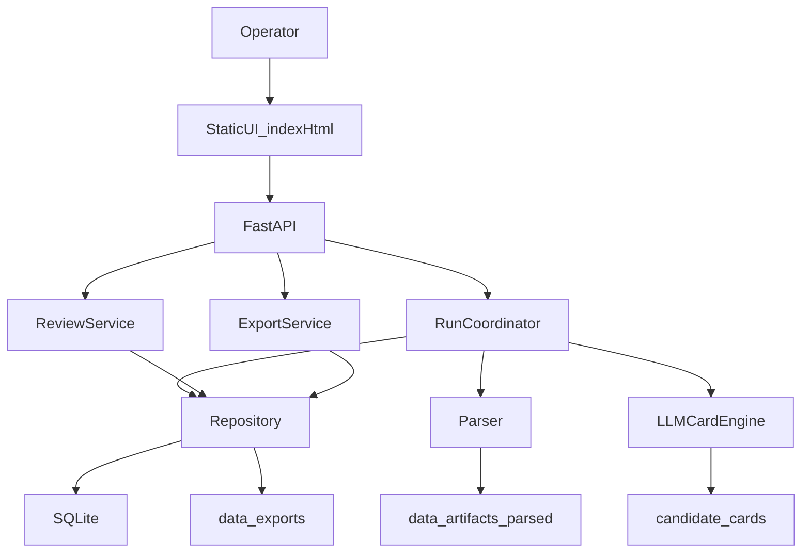

<!--
This file introduces the Paper to Bullet project for new operators and developers.
Main sections: project purpose, architecture, setup, common workflows, and document map.
Data structures covered at a high level: runs, papers, parsed sections, candidate cards, review items, access queue items, and export artifacts.
-->
# Paper to Bullet

`Paper to Bullet` 是一个把论文筛选、理解、卡片抽取、人工 review 和导出串成一条内部工作流的项目。

它的目标不是“做一个通用文献管理器”，而是从论文里筛出**可教、可汇报、可落地的 Aha 卡片**，并把这些卡片送入内部 review list 和导出链路。当前系统已经把论文主链、LLM prompt ontology、review list、access queue、single-paper validation 和 Google Docs export 串起来。

## 这项目现在能做什么

- 并行启动一个 run，按 topic 和本地 PDF 进入处理主链
- 发现论文、解析正文/图、生成 candidate cards 和 excluded content
- 用 staged pipeline 做 `understanding -> planning -> extraction -> judgement`
- 在内部 UI 里做 review、查看 detail、写 persistent comments
- 管理 `Access Queue`，在拿到全文后 reactivation 回主链
- 对 `Review List` 和 `Access Queue` 做 CSV 导出
- 对单篇论文跑 validation，查看 understanding / card plan / stored cards
- 构建 Google Docs 导出包

## 核心判断逻辑

当前 prompt ontology 已经切到 `causal reconstruction first`：

- 真正的 Aha 不是“有用 insight”这么简单
- 它要求学习者对某个**已有经验**的**旧因果解释**，被论文证据**重构**
- 课程包装是后置条件，不是本体

更完整的 ontology 文档见：

- [`AHA.md`](AHA.md)
- [`CONCEPT.md`](CONCEPT.md)

## 系统形状

这是一个单体 FastAPI 应用，前端是一个轻量静态控制台页面。



## 目录结构

```text
app/
  config.py         运行时配置和 .env 读取
  db.py             SQLite schema 和 migration
  llm.py            prompt policy、stage payload、LLM routing
  main.py           FastAPI app 和 HTTP endpoints
  schemas.py        API request models
  services.py       主业务逻辑、Repository、Review/Export/Run 协调
  static/index.html 内部操作台 UI

data/
  artifacts/        论文原始资产、图像资产等
  parsed/           解析产物
  exports/          导出产物
  validation/       single-paper validation 工件
  paper2bullet.sqlite3

scripts/
  live_llm_smoke_test.py
  import_calibration_examples.py
  evaluate_calibration_set.py

tests/
  test_app.py
```

## 本地启动

### 1. 安装依赖

```bash
python3 -m venv .venv
source .venv/bin/activate
pip install -r requirements.txt
```

### 2. 配置环境

项目会读取根目录 `.env`。常见配置项包括：

- `P2B_DATA_DIR`
- `P2B_DB_PATH`
- `P2B_HOST`
- `P2B_PORT`
- `P2B_LLM_MODE`
- `P2B_LLM_BASE_URL`
- `P2B_LLM_API_KEY`
- `P2B_LLM_MODEL`
- `P2B_LLM_TIMEOUT_SECONDS`
- `P2B_GOOGLE_DOCS_MODE`

如果只想跑本地主链和测试，不接 LLM，可以保持：

```dotenv
P2B_LLM_MODE=disabled
```

### 3. 启动服务

```bash
uvicorn app.main:app --reload --port 1908
```

默认地址：

- UI: [http://127.0.0.1:1908/](http://127.0.0.1:1908/)
- 健康检查: [http://127.0.0.1:1908/api/health](http://127.0.0.1:1908/api/health)

## 日常操作入口

### 内部 UI

主页就是内部 operator console，主要面板包括：

- `Start Run`
- `Run Status`
- `Review List`
- `Access Queue`
- `Single Paper Validation`
- `Saturation Trends`
- `Export`

当前 UI 已支持：

- 长列表折叠/展开
- `Review List` CSV 导出
- `Access Queue` CSV 导出
- review detail 中的 persistent comments

### 常用脚本

#### 1. 检查 LLM provider 是否可用

```bash
python3 scripts/live_llm_smoke_test.py
```

#### 2. 导入 calibration set

```bash
python3 scripts/import_calibration_examples.py path/to/calibration.json --activate
```

#### 3. 跑 active calibration set

```bash
python3 scripts/evaluate_calibration_set.py --use-active
```

## 核心数据对象

- `runs`: 一次批处理运行
- `topics`: 主题
- `topic_runs`: 某个 run 下每个 topic 的执行状态
- `papers`: 论文元数据与处理状态
- `paper_sections`: 解析后的正文段落
- `figures`: 图及其资产信息
- `candidate_cards`: 生成出的候选卡片
- `judgements`: LLM judgement 结果
- `paper_excluded_content`: 被排除但保留理由的内容
- `review_decisions`: review 决策历史
- `review_item_comments`: 独立于决策的持续评论
- `access_queue`: 待补全文的论文队列
- `exports`: 导出记录

## 测试

项目当前主要测试都在：

- [`tests/test_app.py`](tests/test_app.py)

常用跑法：

```bash
python3 -m pytest tests/test_app.py
```

如果只想跑快一点的主链回归，可以用 `-k`：

```bash
python3 -m pytest tests/test_app.py -k "review_items or access_queue or export"
```

注意：

- 在某些环境里，如果没安装 `Pillow`，和 figure asset 相关的测试会失败
- `requirements.txt` 已包含 `Pillow`，完整环境下应安装它

## 当前开发重点

如果你是第一次接手，先看这几个文件：

- [`progress.md`](progress.md)：最近完成了什么、没做什么、下次该从哪开始
- [`PRD.md`](PRD.md)：完整产品需求和 build order
- [`AHA.md`](AHA.md)：Aha ontology 本体
- [`CONCEPT.md`](CONCEPT.md)：课程化/卡片化判断标准

如果你是要动 prompt 或筛选逻辑，再看：

- [`app/llm.py`](app/llm.py)
- [`app/services.py`](app/services.py)

如果你是要动 UI，再看：

- [`app/static/index.html`](app/static/index.html)
- [`app/main.py`](app/main.py)

## 已知现实情况

- 当前前端不是框架项目，就是一个单文件静态 UI，优点是简单，缺点是逻辑会集中在 `index.html`
- SQLite 是主存储，已经有一批 migration helper，但改 schema 时仍要小心兼容老测试路径
- prompt / ontology 调整会影响 single-paper validation 和 calibration 行为，改完最好先跑定向回归
- 项目里有不少内部分析文档，README 不替代这些文档，只负责把新接手者送到正确入口

## 文档导航

- 产品需求：[`PRD.md`](PRD.md)
- 进度交班：[`progress.md`](progress.md)
- Aha 本体：[`AHA.md`](AHA.md)
- 课程概念标准：[`CONCEPT.md`](CONCEPT.md)
- 根因修复计划：[`ROOT_CAUSE_REMEDIATION_PLAN.md`](ROOT_CAUSE_REMEDIATION_PLAN.md)
- 去重/饱和治理：[`DEDUPE_SATURATION_REMEDIATION.md`](DEDUPE_SATURATION_REMEDIATION.md)
- 卡片内容治理：[`CARD_CONTENT_REMEDIATION.md`](CARD_CONTENT_REMEDIATION.md)

## 一句话总结

这不是“论文摘要器”，而是一个把论文变成**可判断、可 review、可导出、可教**的 Aha 卡片流水线。
